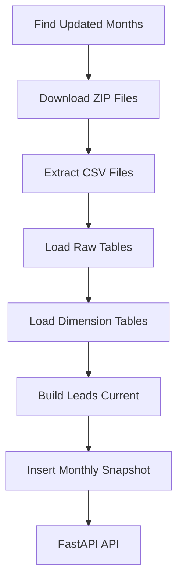

# CNPJ Getter

CNPJ Getter is a simple and stable data pipeline to download, extract, process, and query official Brazilian CNPJ data.

I created this project because the old way Receita Federal used to provide CNPJ data was difficult to work with. The files were large, separated, and not easy to query together.

I was inspired by the open-source project **CNPJ Data Pipeline by caiopizzol on GitHub** (https://github.com/caiopizzol/cnpj-data-pipeline), which builds a modular pipeline for processing Brazilian CNPJ data into a database like PostgreSQL.:contentReference[oaicite:1]{index=1}

However, I wanted to make something **simpler, explicit, and tailored to my goals**:  
I needed an easy way to **combine CNAE, municipality, and state (UF)** into a single views/tables that are easy to query.

---

## Overview

The system performs the following steps:

- Download monthly ZIP files from Receita Federal (WebDAV)
- Extract CSV files
- Load raw data into DuckDB
- Load dimension tables
- Build consolidated leads table
- Store monthly historical snapshots
- Expose data through a FastAPI API

The pipeline is idempotent.  
Running it multiple times does not break the database.

---

## Architecture

The project is organized by domain responsibility:

- **Downloader** → downloads ZIP files
- **Extractor** → extracts CSV files
- **Warehouse** → loads and transforms data
- **Query Service** → read-only access layer
- **API** → exposes leads data

Each class has a single responsibility.

The code is explicit and predictable.  
Clarity is more important than complex abstractions.

---

## Data Flow

